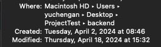
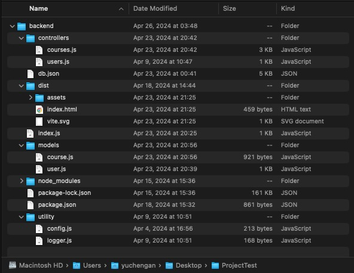
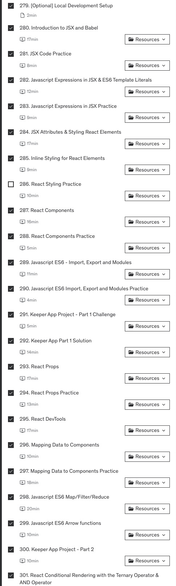
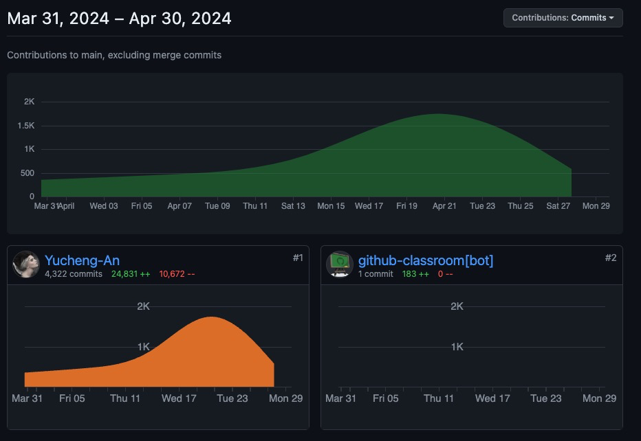

## Courses Information Hub Application

### Information
Author: Yucheng An  
Project Course: Web Development 
Instructor: Prof. Osvaldo Jimenez 

### How to download and run the project?

All code has been submitted to https://github.com/comp227/final-yucheng-an.git 
You can run 
`git clone https://github.com/comp227/final-yucheng-an.git`
to get the repository to the local environment.  
https://github.com/Yucheng-An/227Application.git is the fork version from the original repository.  
which has been deployed on Render [(CLICK ME)](https://finalprojectwebdevelopment.onrender.com)
_It might take some time to run building and deploying._

### What functionality is present?

Implemented **User login** and **logout** functions, and **user tokens generation**,  **verification**, and **local storage**.

Implemented **verified username and password** and **display notification** if error occurs.

Implemented display **user information** and display **current time** .

Implemented **Search Bar** for searching course title or instructor name, **Google search redirection**, and a button to link official website of MSCS at UOP

Implemented **display as list** of  Computer Science of UOP 2024 Fall 200 level courses (COMP-2XX).

Achieved **sort list** by number of likes for each course.

Implemented **show and hide** the detail button of each class or just **click list**.

Click the Post Board course button **display the input component**.

In Post Board, the user can **click like button to increase like number** and display as live.

The posted Comment supported users **can post comments** on a certain course,
and the comments will be **displayed in real-time**.
At the same time, **only the comment creator can delete the comments**.

Implemented **verified user cannot post empty comment** and **display notification** if an error occurs.

Implemented cancel button to **close window** of Post Board.

For display and test purposes, added _Demo and Switch_ buttons to auto-login and logout between two different users.

### What is still missing?

Still missing the **create user** frontend.
Missing building frontend and service. (But you still can use Postman to create a new user)

[Backend POST request](https://github.com/Yucheng-An/227Application/blob/12ea65c2c0c566a1b2ffea0dec4787f80bc47efd/backend/controllers/users.js#L31C1-L43C1)
and [Backend user Schema](https://github.com/Yucheng-An/227Application/blob/12ea65c2c0c566a1b2ffea0dec4787f80bc47efd/backend/models/user.js#L4C1-L17C4)

Still missing rich [login page UI and design CSS](https://github.com/Yucheng-An/227Application/blob/12ea65c2c0c566a1b2ffea0dec4787f80bc47efd/frontend/src/components/Login.jsx#L3C1-L41C2)

### What technologies/libraries were used?

#### Backend:
1. Json-server_1.0.0 (development)
2. Mongoose-unique-validator_5.0.0
3. Nodemon_3.1.0 (development)
4. Axios_1.6.8
5. Bcrypt_5.1.1
6. Cors_2.8.5
7. Dotenv_16.4.5
8. Express_4.19.2
9. Jsonwebtoken_9.0.2
10. Mongoose_8.3.0
11. Node.js_18.13.0

#### Frontend:
1. Axios_1.6.8
2. React_18.2.0
3. HTML5
4. CSS
5. Node.js_18.13.0
6. Eslint_8.57.0
7. Vite_5.2.0

#### Tools:
1. JetBrains-WebStorm_2024.1.1
2. iTerm2
3. Google Chrome
4. FireFox
5. Postman
6. Discord
7. Git
8. Github
9. Render
10. Mongoose Web

#### Explanation

In the beginning of project development,
I was coding in the local environment to test different situations in backend request and response
that's reason why there might be some gap day commits on Git.

In addition, I also re-studied React and front-end knowledge on Udemy in my spare time which was called ["The Complete 2024 Web Development Bootcamp
"](https://www.udemy.com/course/the-complete-web-development-bootcamp/?couponCode=ST2MT43024)
After all, I had never learned JavaScript before this semester, so I needed time to practice and I kept practicing code. 

I watched Youtube videos of the development of Node.js and Express.js - Backend. [Link](https://www.youtube.com/watch?v=Oe421EPjeBE)

### **I don't have any "gap"** (Longer than 4-ish days without working on the project).

On April 26th and April 29th, I didn't work on the project at all, just because I was going to have two final exams.
So, I put the these for studying other courses.

This is the Contribution of my project.
